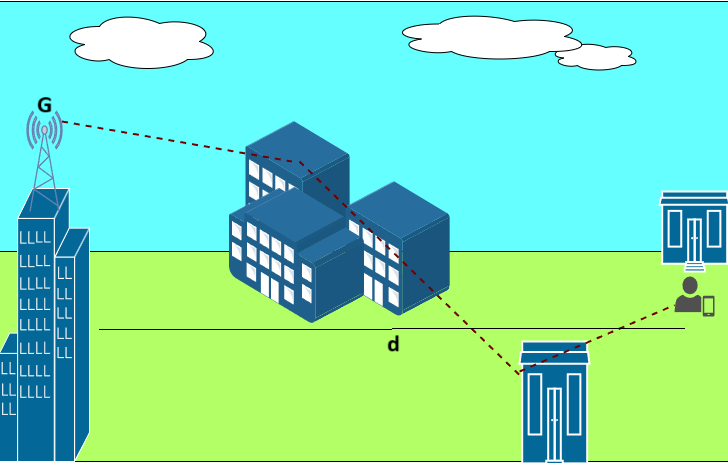

Link budget is an important aspect of wireless communication systems design. It accounts for all gains and losses. Two major factors that cause a variation in the received signal(loss) are Pathloss and shadowing. Thus, an accurate characterization of these two effects is crucial for planning the link budget. Let us now understand these effects in detail.

In wireless propagation analysis, variations in received signal power are broadly categorized into **large-scale fading** and **small-scale fading**.  
Large-scale fading refers to the slow variation of the average received power over long distances and is primarily governed by **pathloss** and **shadowing**.  
Small-scale fading, on the other hand, is caused by multipath interference due to reflections, scattering, and diffraction, leading to rapid fluctuations in signal amplitude over distances comparable to the signal wavelength.  

Since link budget planning depends mainly on the **average received power**, this experiment focuses on **large-scale fading effects**, namely pathloss and shadowing.

## Pathloss
Pathloss is a measure of signal attenuation (i.e. reduction in received signal power) along its path from the $T_{X}$ to $R_{X}$. Mathematically, linear pathloss is defined as the ratio of the transmit power to received power given as

$$
\begin{aligned}
    PL = \frac{P_{t}}{P_{r}}
\end{aligned}
$$

$$
\begin{aligned}
    PL(\text{in dB}) = 10~ \log_{10} \frac{P_t}{P_{r}}
\end{aligned}
$$

The **decibel (dB) scale** is widely used in wireless communications because it converts multiplicative gains and losses into **additive quantities**, greatly simplifying link-budget calculations. It also allows convenient comparison of very large or very small power ratios using manageable numerical values.

In general, the recieved power $P_r$ is dependent on the following factors:
- Antenna gains of $T_X$ and $R_X$, $G_t$ and $G_r$ respectively. Antenna gain measures the efficiency of an antenna to focus the signal energy in a specific direction. We can say that a direction-specific antenna(the one with higher G) leads to a increase in $P_r$.
- Distance between the $T_{X}$ and $R_{X}$, $d$. The recieved power decreases with distance. 
- Signal wavelength, $\lambda$. Signals with higher wavelengths travel effectively over longer distances and can also bend around obstacles due to their low carrier frequency. This indicates that $P_r$ increases.
- Since wavelength is inversely proportional to frequency $(\lambda = c/f)$, this implies that:
    - **Higher carrier frequency → smaller wavelength → larger pathloss**
    - **Lower carrier frequency → larger wavelength → smaller pathloss and better coverage**
Therefore, signals operating at **sub-GHz frequencies** (e.g., TV, cellular bands) typically achieve **longer propagation distances** and better penetration through obstacles, whereas **millimeter-wave and higher-frequency signals** experience **significantly higher attenuation** and require denser transmitter deployment.

From the Friis free-space transmission equation,

$$
\begin{aligned}
    P_r = P_t~ G \left(\frac{\lambda}{4\pi d}\right)^2
\end{aligned}
$$

where, $G_{t} G_{r}=\sqrt{G}$ is the combined antenna gain.

The above expression for recieved power is in coherence with our understanding.

we can now express Pathloss as

$$
\begin{aligned}
    PL(\text{in dB}) = 10~ \log _{10}\left(\frac{4 \pi d}{\lambda \sqrt{G}}\right)^{2},
\end{aligned}
$$

$$
\begin{aligned}
    PL(\text{in dB}) =  10\log_{10}K - 10\gamma \log_{10} \frac{d}{d_0}
\end{aligned}
$$

where, $K$ is the pathloss at a reference distance $d_0$.

Here, the parameter $\gamma$ is known as the **pathloss exponent**, which captures how quickly the signal attenuates with distance in a given propagation environment.  
Typical values include:
- Free space: $\gamma = 2$  
- Urban environments: $\gamma \approx 2.7$–$3.5$  
- Indoor or obstructed environments: $\gamma \approx 3$–$5$  

Thus, the **environment directly influences large-scale signal attenuation** through the pathloss exponent.

 
 
The above discussion pertains to free-space propagation. In terrestrial wireless networks, however, the presence of multipath components causes the pathloss characteristics to vary across different regions. This variation arises from the constructive and destructive interference of multipath signals at the receiver. To account for such effects, several empirical pathloss models have been developed, including the Okumura, Hata, and COST-231 models. These models incorporate environmental factors, the pathloss exponent, operating frequency, and the heights of the transmitter and receiver antennas to more accurately characterize signal attenuation. 

In this experiment, the Okumura pathloss model is employed to simulate large-scale signal attenuation under realistic terrestrial propagation conditions. The pathloss at a distance d can be expressed using the Okumura model as 

$$
\begin{aligned}
    PL(d) = L(f_c,d) + A_\mu(f_c,d) - G(h_t) -G(h_r) - G_{AREA}
\end{aligned}
$$

where $L(f_c,d)$ is the free space pathloss, $A_\mu(f_c,d)$ is the median attenuation in addition to free space path loss across all environments, $G(h_t)$ and $G(h_r)$ are the transmitetr and reciever height gains and $G_{AREA}$ is the gain of the environment.

## Pathloss with shadowing
Now, after understanding the concept of pathloss, have you wondered if the pathloss in any direction of the same distance is equal? Not necessarily. This is due to the effect of shadowing! Not just the distance between the $T_{X}$ and $R_{X}$, but also the propogation environment, containing obstacles that lead to absorption, reflection, and scattering etc of the signal leads to an attenuation of the received signal power. This attenuation is a random value. This leads to an additional term in the pathloss equation as follows

$$
\begin{aligned}
    PL(\text{in dB})= 10\log_{10}K - 10\gamma \log_{10} \frac{d}{d_0} - \psi_{dB}
\end{aligned}
$$

The random variable $\psi_{dB}$ represents **shadowing**, which models slow variations in received power caused by large obstacles such as buildings, foliage, and terrain. Unlike deterministic pathloss, shadowing is **statistical in nature** and varies from one location to another even at the same distance from the transmitter.

The most common model for this additional attenuation, $\psi$, is log-normal shadowing. This model has been empirically confirmed to accurately capture the variation in received signal power in both outdoor and indoor radio propagation environments.

$$
\begin{aligned}
    p_\psi(\psi)=\frac{\varepsilon}{\sqrt{2 \pi} \sigma_{\psi_{d B}} \psi} \cdot \exp \left[\frac{-\left(10 \log_{10} \psi-\mu_{\psi d B}\right)^{2}}{2 \sigma_{d}^{2}}\right],
\end{aligned}
$$

where $\varepsilon=\frac{10}{\ln 10}$. $\mu_{\psi_{\text{dB}}}$ is the mean pathloss and mean attenuation due to the obstacles. The mean power varies with distance due to path loss and the fact that average attenuation from objects increases with distance due to the potential for a larger number of attenuating objects. $\sigma_{\psi_{\text{in dB}}}$ is the standard deviation of the environment ranging from four to thirteen.

Smaller values of $\sigma$ correspond to **open or rural environments**, while larger values indicate **dense urban or heavily obstructed indoor environments**.  
Therefore, shadowing provides a **probabilistic description of environmental impact** on large-scale wireless signal propagation.

We can view the visual illustration of Pathloss and shadowing in the below figure.

